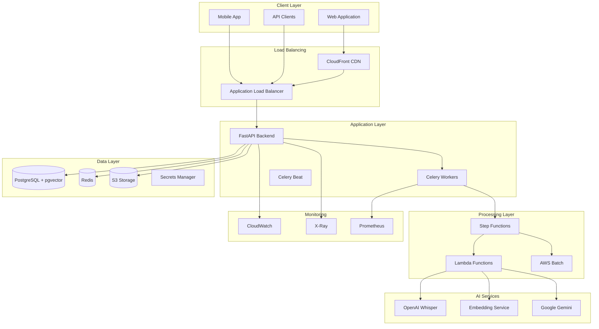
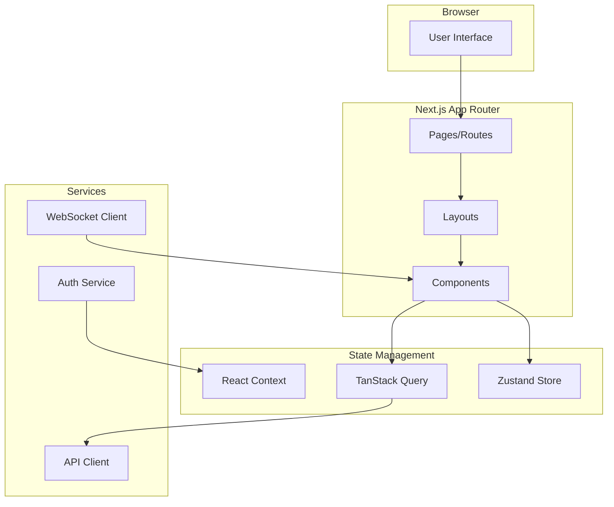
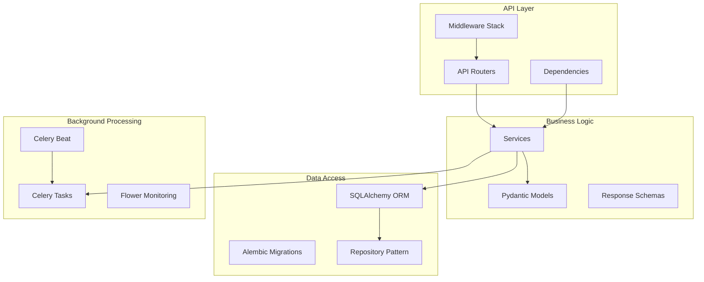
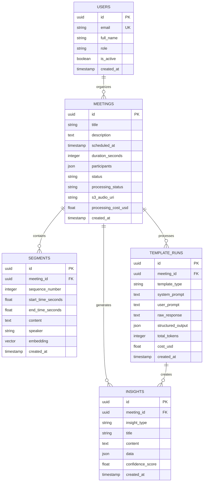
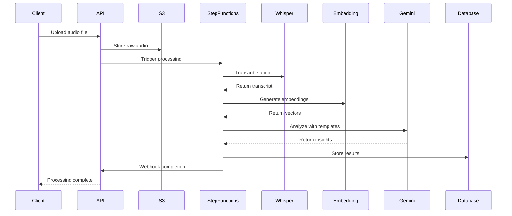
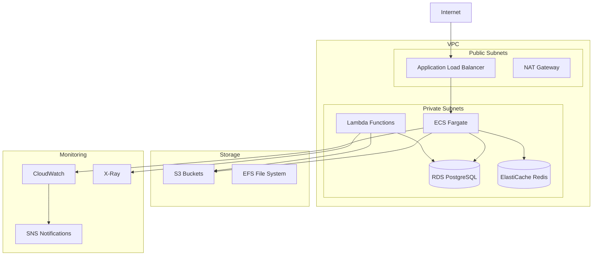
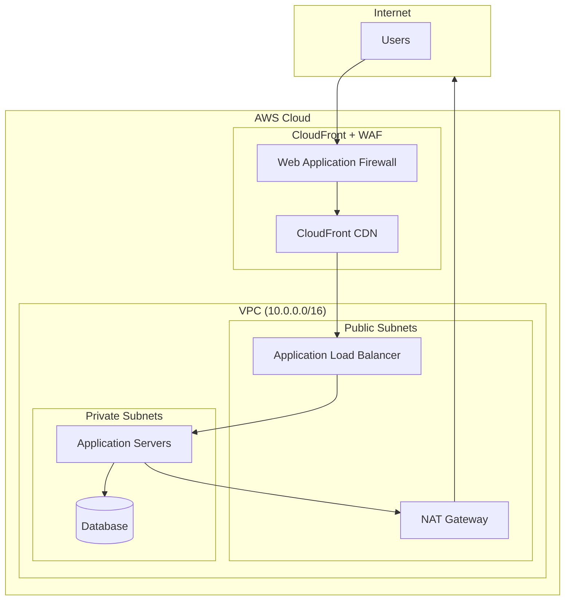
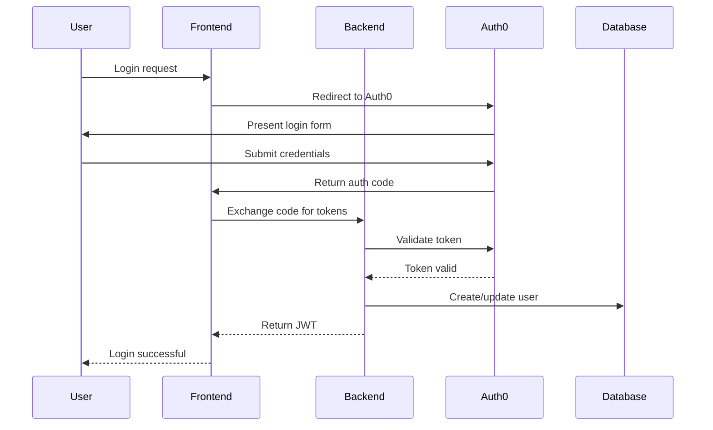
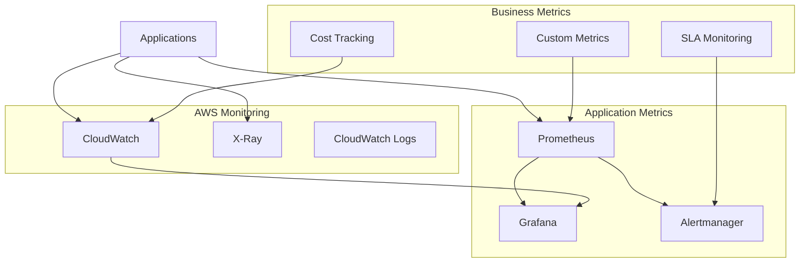

# Meeting AI - Architecture Documentation

## Overview

Meeting AI is a cloud-native, microservices-based platform designed for high-scale meeting intelligence processing. This document provides detailed architectural insights for developers, DevOps engineers, and system architects.

## System Architecture

### High-Level Architecture



## Component Architecture

### Frontend Architecture (Next.js 14)



**Key Design Decisions:**
- **App Router**: Leverages Next.js 14's new routing system for better performance
- **Server Components**: Reduces client-side JavaScript bundle size
- **Streaming**: Progressive page loading for better perceived performance
- **TypeScript**: Full type safety across the application

### Backend Architecture (FastAPI)



**Key Design Patterns:**
- **Dependency Injection**: Clean separation of concerns
- **Repository Pattern**: Abstracted data access layer
- **Service Layer**: Business logic encapsulation
- **Async/Await**: Non-blocking I/O operations

## Data Architecture

### Database Design



### Vector Storage Strategy

**pgvector Implementation:**
- **Embedding Dimension**: 1536 (OpenAI text-embedding-3-small)
- **Index Type**: IVFFlat with 100 lists for <1M vectors
- **Distance Metric**: Cosine similarity for semantic search
- **Chunking Strategy**: 256 tokens with 32 token overlap

```sql
-- Vector index creation
CREATE INDEX ix_segments_embedding_ivfflat 
ON segments USING ivfflat (embedding vector_cosine_ops) 
WITH (lists = 100);

-- Semantic search query
SELECT id, content, 1 - (embedding <=> $1::vector) as similarity
FROM segments 
WHERE 1 - (embedding <=> $1::vector) > $2
ORDER BY similarity DESC 
LIMIT $3;
```

## Processing Architecture

### Audio Processing Pipeline



### Step Functions State Machine

```json
{
  "Comment": "Meeting processing pipeline",
  "StartAt": "TranscribeAudio",
  "States": {
    "TranscribeAudio": {
      "Type": "Task",
      "Resource": "arn:aws:lambda:region:account:function:whisper-processor",
      "Retry": [{"ErrorEquals": ["States.ALL"], "MaxAttempts": 3}],
      "Next": "ChunkAndEmbed"
    },
    "ChunkAndEmbed": {
      "Type": "Task",
      "Resource": "arn:aws:lambda:region:account:function:embedding-processor",
      "Next": "AnalyzeTemplates"
    },
    "AnalyzeTemplates": {
      "Type": "Map",
      "ItemsPath": "$.templates",
      "MaxConcurrency": 5,
      "Iterator": {
        "StartAt": "ProcessTemplate",
        "States": {
          "ProcessTemplate": {
            "Type": "Task",
            "Resource": "arn:aws:lambda:region:account:function:template-processor",
            "End": true
          }
        }
      },
      "Next": "StoreResults"
    },
    "StoreResults": {
      "Type": "Task",
      "Resource": "arn:aws:lambda:region:account:function:result-processor",
      "End": true
    }
  }
}
```

## Infrastructure Architecture

### AWS Infrastructure



### Container Architecture

**Backend Container (ECS Fargate)**
```dockerfile
FROM python:3.11-slim
WORKDIR /app
COPY requirements.txt .
RUN pip install -r requirements.txt
COPY . .
CMD ["uvicorn", "app.main:app", "--host", "0.0.0.0"]
```

**Frontend Container (ECS Fargate)**
```dockerfile
FROM node:18-alpine
WORKDIR /app
COPY package*.json ./
RUN npm ci --production
COPY . .
RUN npm run build
CMD ["npm", "start"]
```

## Security Architecture

### Network Security



### Authentication Flow



## Monitoring Architecture

### Observability Stack



### Key Metrics

**Application Metrics:**
- Request latency (p50, p95, p99)
- Error rates by endpoint
- Database connection pool usage
- Cache hit/miss ratios

**Business Metrics:**
- Meetings processed per hour
- Average processing time
- AI service costs per meeting
- User engagement metrics

**Infrastructure Metrics:**
- CPU and memory utilization
- Database query performance
- Storage usage and growth
- Network throughput

## Scalability Considerations

### Horizontal Scaling

**Frontend:**
- CloudFront CDN for global distribution
- Multiple ECS tasks across availability zones
- Auto-scaling based on CPU/memory metrics

**Backend:**
- Load balancer with health checks
- ECS service auto-scaling
- Database read replicas
- Redis cluster mode

**Processing:**
- Lambda functions for burst capacity
- SQS queues for task distribution
- Step Functions for workflow orchestration
- Batch jobs for large-scale processing

### Performance Optimization

**Database:**
- Connection pooling (20 connections per instance)
- Query optimization with EXPLAIN plans
- Materialized views for analytics
- Partitioning for large tables

**Caching Strategy:**
- Redis for session data (TTL: 30 minutes)
- Application-level caching for API responses
- CDN caching for static assets
- Database query result caching

## Disaster Recovery

### Backup Strategy

**Database:**
- Automated daily backups with 7-day retention
- Point-in-time recovery capability
- Cross-region backup replication
- Backup encryption with AWS KMS

**Storage:**
- S3 cross-region replication
- Versioning enabled on all buckets
- Lifecycle policies for cost optimization
- Glacier Deep Archive for long-term retention

### Recovery Procedures

**RTO/RPO Targets:**
- Database: RTO < 4 hours, RPO < 1 hour
- Application: RTO < 1 hour, RPO < 15 minutes
- Storage: RTO < 2 hours, RPO < 24 hours

## Cost Optimization

### Resource Optimization

**Compute:**
- Spot instances for non-critical workloads
- Reserved instances for baseline capacity
- Lambda for variable workloads
- ECS Fargate for container orchestration

**Storage:**
- S3 Intelligent Tiering
- EBS gp3 volumes with optimized IOPS
- CloudFront for bandwidth optimization
- Data compression and deduplication

### Cost Monitoring

**Budget Controls:**
- AWS Budgets with alerts at 80%, 100%
- Cost anomaly detection
- Resource tagging for cost allocation
- Monthly cost reviews and optimization

---

This architecture documentation provides the foundation for understanding, maintaining, and evolving the Meeting AI platform. For specific implementation details, refer to the individual service documentation.